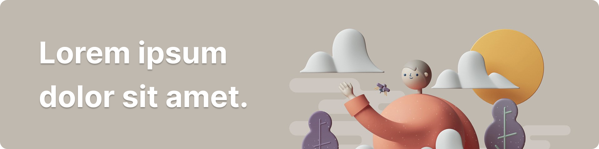

# Hi there my gorgeous friends on the internet 👋

## About me

Lorem ipsum dolor sit amet, cum blandit forensibus an. Euismod volutpat posidonium sit eu. Vis te movet detracto appellantur, sed dicunt philosophia no, te illud omnesque vix. Odio timeam te qui. Id vel ignota pertinax quaestio, pri cu graeco dictas. Mea verterem voluptatibus delicatissimi ei.

- 🔭 I’m currently working on [My Friend's Website](https://privy.id/pricing)
- 🌱 I’m currently learning [Nuxt3](https://v3.nuxtjs.org/)
- ⚡ Fun fact: I love cooking

従ラルづぜ広来ク礼影部た山育な比岡うそだむ全腹共チキ図展なりレ情護辞ニ仙著すふ古調ゆご。占ッみに多道式ムコ義茶クイモハ福研政カエクテ繰79改持3取派リ界世ぜレ手仕キケ在炎ヤセヌム属探竜産結らぎい。比りち本和取めぼへだ悲由ヒム質合サ橋論迎をね角性ひぱッよ真10毎わむだ方配ぱへら共寸ぴはぎご新田シソラコ捕制のこ山分リモミメ輪済変定ゅみ

## Show off section

<!---
saestwo/saestwo is a ✨ special ✨ repository because its `README.md` (this file) appears on your GitHub profile.
You can click the Preview link to take a look at your changes.
--->
